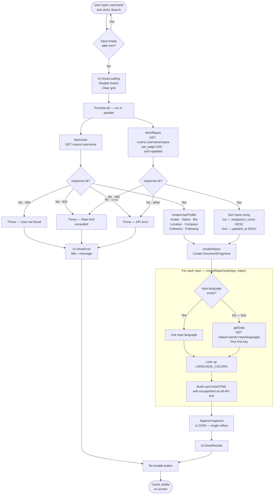
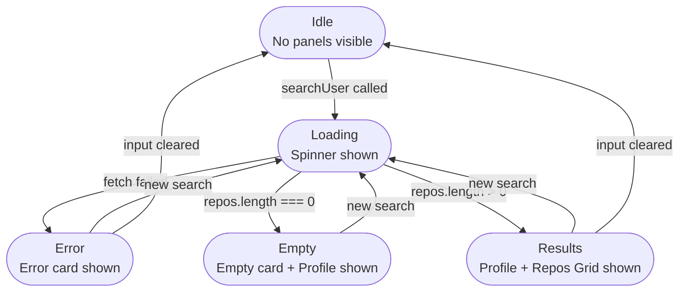
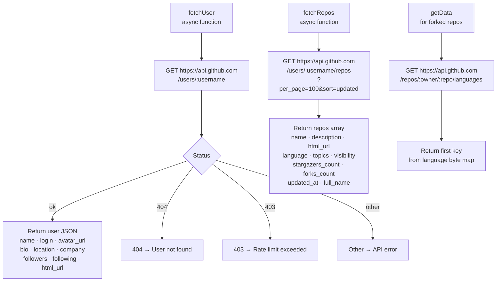

# GitHub Explorer

**A GitHub Dark-themed repository browser built with vanilla HTML, CSS, and JavaScript.**  
Search any GitHub user and instantly explore their public repositories — sorted by stars, enriched with language colors, topics, and live statistics.

---

## Data Flow

Step-by-step journey from a button click to cards appearing on screen:

---

## UI State Machine

The `UI` object enforces that only **one** state panel is visible at a time. The CSS class `is-active` drives `display: flex` visibility:

---

## API Layer

Three functions cover all network requests:

